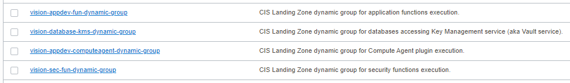
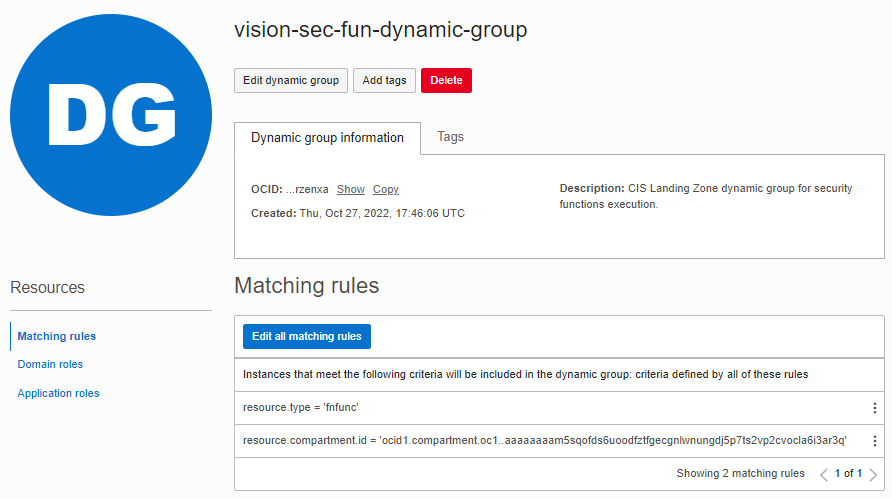

# OCI Dynamic Groups Module Usage Example - CIS Landing Zone Quick Start

## Introduction

This example shows how to deploy [CIS Landing Zone Quick Start](https://github.com/oracle-quickstart/oci-cis-landingzone-quickstart) dynamic groups in Oracle Cloud Infrastructure.

It creates the following dynamic groups as shown in the picture below:



Looking into one of them:



## Using this example
1. Prepare one variable file named *terraform.tfvars* with the required information for authenticating to OCI. The contents of *terraform.tfvars* should look something like the following (or copy and re-use the contents of *terraform.tfvars.template*):

```
### TENANCY DETAILS
#
# Get this from OCI Console (after logging in, go to top-right-most menu item and click option "Tenancy: <your tenancy name>").
tenancy_id="<tenancy OCID>"
#
# Get this from OCI Console (after logging in, go to top-right-most menu item and click option "My profile").
user_id="<user OCID>"
#
# The fingerprint can be gathered from your user account. In the "My profile page, click "API keys" on the menu in left hand side).
fingerprint="<PEM key fingerprint>"
#
# This is the full path on your local system to the private key used for the API signing key pair.
private_key_path="<path to the private key that matches the fingerprint above>"
#
# This is the password that protects the private key, if any.
private_key_password=""
#
# This is your tenancy home region.
home_region="<your tenancy home region>"
```

2. Check the provided *input.auto.tfvars* file. It has a single map variable named *groups*. 

**Caution**: Within the map, each object is identified by a key (in uppercase), like *SEC-FUN-DYN-GROUP*, *APPDEV-FUN-DYN-GROUP*, etc. These can actually be any strings, but once defined they MUST NOT be changed, or Terraform will try to recreate the dynamic groups upon *terraform apply*.

```
dynamic_groups = {  
  SEC-FUN-DYN-GROUP : { 
    name : "vision-sec-fun-dynamic-group",  
    description : "CIS Landing Zone dynamic group for security functions execution.",      
    matching_rule : "ALL {resource.type = 'fnfunc',resource.compartment.id = '<REPLACE-THIS-BY-SECURITY-COMPARTMENT-OCID>'}", 
    defined_tags : null, 
    freeform_tags : null
  },
  APPDEV-FUN-DYN-GROUP : { 
    name : "vision-appdev-fun-dynamic-group",  
    description : "CIS Landing Zone dynamic group for application functions execution.",      
    matching_rule : "ALL {resource.type = 'fnfunc',resource.compartment.id = '<REPLACE-THIS-BY-APPLICATION-COMPARTMENT-OCID>'}", 
    defined_tags : null, 
    freeform_tags : null
  },  
  APPDEV-COMPUTE-AGENT-DYN-GROUP : { 
    name : "vision-appdev-computeagent-dynamic-group",  
    description : "CIS Landing Zone dynamic group for Compute Agent plugin execution.",      
    matching_rule : "ALL {resource.type = 'managementagent',resource.compartment.id = '<REPLACE-THIS-BY-APPLICATION-COMPARTMENT-OCID>'}", 
    defined_tags : null, 
    freeform_tags : null
  },                                        
  DATABASE-KMS-DYN-GROUP : { 
    name : "vision-database-kms-dynamic-group",  
    description : "CIS Landing Zone dynamic group for databases accessing Key Management service (aka Vault service).",      
    matching_rule : "ALL {resource.compartment.id = '<REPLACE-THIS-BY-DATABASE-COMPARTMENT-OCID>'}", 
    defined_tags : null, 
    freeform_tags : null
  }
}
  
```

3. Check the provided *main.tf* file. It calls the groups module for resource management. 

`main.tf`:

```
module "cislz_dynamic_groups" {
  source         = "../../"
  tenancy_id     = var.tenancy_id
  dynamic_groups = var.dynamic_groups
}
```

4. Then execute the example using the usual Terraform workflow:

```
$ terraform init
$ terraform plan
$ terraform apply
```